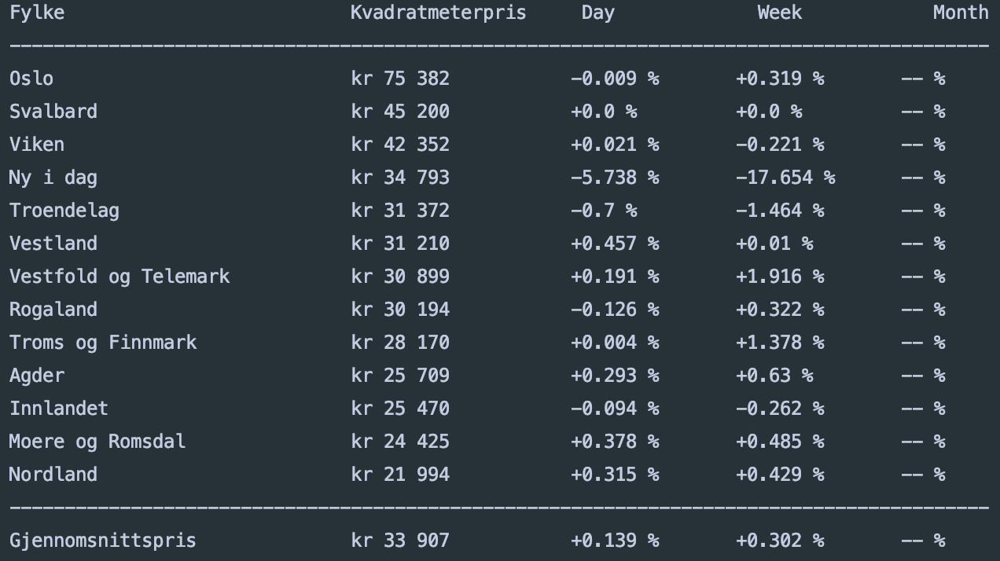

# property_prices
Web scraper for collecting properties from finn.no and analysing prices using scrapy

## Program Flow

- [x] Gather property data from Finn using Scrapy
- [x] Store in JSON-file
- [x] Extract data from JSON for analysis
- [x] Analyse prices per sqm
- [x] Store location specific data for each date - JSONLines? CSV?
- [x] Extract data by date for analysis
- [x] Compare todays data with yesterday, week, month and potentially year
- [x] Schedule daily data gathering with crontab
- [ ] Send report through email


## Running the script

The script uses the [Scrapy](https://docs.scrapy.org/en/latest/index.html) web scraper framework. 
A Python virtualenv is recommended when installing Scrapy.

```
pip3 install scrapy
```

The web scraper is run by the following command:
```
python3 trends.py
```

### Example Output

